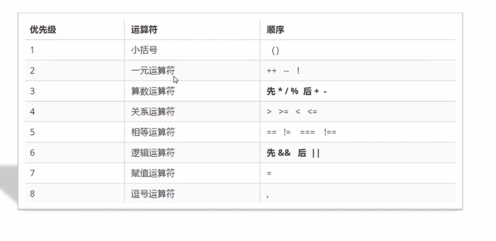
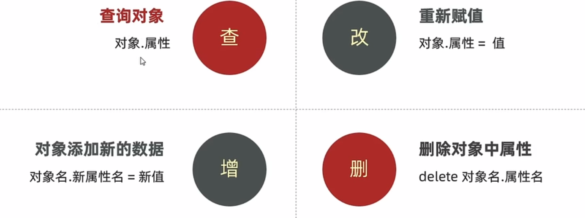

> 以下是观看黑马程序员前端JavaScript课程所做的笔记。
>
> [黑马程序员前端JavaScript](https://www.bilibili.com/video/BV1Y84y1L7Nn/?spm_id_from=333.337.search-card.all.click)

# JavaScript简介

**JavaScript是什么？**

js是一门编程语言，可以实现很多网页的交互效果。

**JavaScript的书写位置**

1.内部js-行内js

2.内部js-写在`</body>`标签的上方

3.外部js-写在`<script></script>`内，但`<script>`标签不要写内容，否则会被忽略

**JavaScript注释**

1.单行注释 //

2.多行注释 /* */

**JavaScript的结束符**

分号：可以加也可以不加，可以按照团队约定。

**JavaScript输入输出语句？**

输入：`prompt()`
 
输出：`document.write()`、`console.log()`、`alert()`

# 变量

## 变量是什么？

目标：理解变量是计算机存储的 "容器"

**注意：变量不是数据本身，它们仅仅是一个用于存储数值的容器。可以理解为一个个用来装东西的纸箱子。** 

## 变量有什么作用?

用来存放数据的。注意变量指定是容器而不是数据。

## 变量的基本使用

1.声明变量

语法：let 变量名    举例：let age

    1) 声明变量由两部分构成：声明关键字、变量（标识）
    2) let即关键字，所谓关键字是系统提供发专门用来声明(定义)变量的词语


2.变量赋值

定义一个变量后，你就能够初始化它(赋值)。在变量名后跟上 "=" ，然后是数值。

**注意：我们是通过变量名来获得变量里面的数据**

举例：```let age = 18``` //声明变量的同时直接完成赋值操作，这样的操作也称为变量的初始化

3.变量更新

变量赋值后，还可以通过简单地给它一个不同的值来更新它

**注意：let不允许多次声明一个变量**

4.声明多个变量

语法：多个变量中间用逗号隔开

举例：```let nnum = 19, uname = 'lily'; ```

**说明：看上去代码长度更短，但不推荐这样。为了更好的可读性，建议一行声明一个变量。**

## 变量的本质

内存：计算机中存储数据的地方。相当一个空间

变量本质：是程序在内存中申请的一块用来存放数据的小空间

## 变量的命名规则和规范

规则：必须遵守，不遵守报错

规范：建议，不遵守不会报错，但不符合业内通识（道德层面）

1.规则：
    
    1) 不能使用关键字
        关键字：有特殊含义的字符，JavaScript内置的一些英语词汇。例如：let、var、if、for等
    2) 只能用下划线、字母、数字、$组成，且不能数字开头
    3) 字母严格区分大小写，如 Age 和 age 是不同的变量

2.规范

    1) 起名要有意义
    2) 遵守小驼峰命名法
        第一个单词首字母小写，后面每个单词首字母大写。如：userName

# 变量的扩展-let和var的区别

**let 和 var 的区别：**

在较旧的JavaScript，使用关键字var来声明变量，而不是let

let为了解决var的一些问题

var 声明：

    1) 可以先使用，在声明（不合理）
    2) var声明过程的变量可以重复声明（不合理）
    3) 比如变量提升、全局变量、没有块级作用域等等

**结论：**

以后声明变量统一使用let

# 变量的拓展-数组

数组：一种将一组数据存储在单个变量名下的优雅方式

语法：let arr = []

## 数组的基本使用

1.声明变量

let 数组名 = [数据1,数据2,...,数据n]

举例：let names = ['jerry','tom','lily']

    1) 数组是按顺序保存的，所以每个数据都有自己的编号
    2) 计算机中的编号从0开始，所以 数据1 的编号为0，数据2 的编号为1，以此类推
    3) 在数组中，数据的编号也叫索引或者下标
    4) 数据可以存储任意类型的数据

2.取值语法

数组名[下标]

举例：

let names = ['jerry','tom','lily'] 

names[0] = 'jerry'

    1)  通过下标取值
    2)  取出来是什么类型，就根据这种类型特点来访问

3.一些术语

    元素：数组种保存的每个数据都叫数组元素
    下标：数组中数据的编号
    长度：数组中数据的个数，通过数组的length属性获得

# 常量

**概念：** 使用const声明的变量称为"常量"

**使用场景：** 当某个变量永远不会改变的时候，就可以使用const来声明，而不是let

**命名规范：** 和变量一致

**常量使用：** const G = 9.8

**注意：常量不允许重新赋值，声明的时候必须赋值（初始化）** 

**小技巧：不需要重新赋值的数据使用const**


# 数据类型

JS数据类型分为两大类：

    基本数据类型
        number
        string
        boolean
        undefined
        null

    引用数据类型
        object

>**注意**
>
>JS是弱数据类型，变量到底属于哪种类型，只有赋值之后，我们才能确认
>
>Java是强数据类型，例如：```int a = 3``` 必须是整数

## 数字类型

1.JavaScript中的正数、负数、小数等，统一称为数字类型

2.数学运算符也叫做算术运算符，主要包括加、减、乘、除、取余（求模）

3.**先乘除后加减，有括号先算括号内的**

4.NaN代表一个计算错误。它是一个不正确的或者一个未定义的数字操作所得的结果。

5.NaN是粘性。任何对NaN的操作都会返回NaN

## 字符串类型

1.通过 单引号 '' , 双引号 "" , 反引号 `` 包裹的数据都叫字符串。单双引号没什么区别，推荐用单。

>**注意**
>
>1.无论单引号或者双引号必须成对使用
>
>2.单引号/双引号可以相互嵌套，但是不可以自己嵌套自己（口诀：外单内双 或者 外双内单）
>
>3.必要时可以使用转义字符 \ ，输出单引号或者双引号

2.字符串拼接

    `+`运算符可以实现字符串拼接

3.模板字符串

**使用场景**

    1) 拼接字符串和变量
    2) 在没它之前，拼接字符串比较麻烦

**语法**

    1) ``(反引号)
    2) 内容拼接变量时，使用${}包住变量

```document.write(`大家好，我叫${name}，今年${age}岁`)```

## 布尔值类型

表示肯定（true）或否定（false）时在计算机中对应的是布尔值类型

## 未定义类型

未定义是比较特殊的类型，只有一个值undefined

**什么时候出现未定义类型?**

    只声明变量，不赋值的情况下，变量的默认值为 undefined，一般很少【直接】为某个变量赋值为undefined。

**工作使用场景**

    在开发中经常声明一个变量，等待传送过来的数据。
    如果我们不知道这个数据是否传递过来，此时我们可以通过监测这个变量是不是undefined，就判断用户是否有数据传递过来。

## null（空类型）

JavaScript中的null仅仅是一个代表"无"，"空" ，"值未知"的特殊值

**null和undefined的区别**

    1) undefined表示没有赋值
    2) null表示赋值了，但内容为空

**null开发中的使用场景**

    将来有个变量里面存放的是一个对象，但是对象还没创建好，可以先给个null

# 检测数据类型

**通过typeof关键字检测数据类型**

支持一下两种语法形式：

1. 作为运算符 : typeof x (常用写法)
2. 函数形式：typeof(x)

# 类型转换

## 为什么需要类型转换

JavaScript是弱数据类型：JavaScript不知道变量的数据类型，只有赋值了才清楚。

坑：使用表单、prompt获取过来的数据默认是字符串类型的，此时无法进行简单的加法运算。因此需要转换数据类型。

## 隐式转换

某些运算符被执行时，系统内部自动将数据类型进行转换，这种转换称为隐式转换

**规则**

    1) +号两边只要有一个是字符串，都会把另外一个转为字符串
    2) 除了+以为的运算符，都会把数据转为数字类型

**缺点**

    转换类型不明确，靠经验才能总结

**小技巧**

    1) +号作为正好解析可以转换为数字类型
    2) 任何数据和字符串相加结果都是字符串

## 显示转换

为了避免隐式转换带来的问题，通常需要对数据进行显示转换

**概念**

自己写代码告诉系统应该转成什么类型

**转换为数字型**

Number(数据)

    1) 转换为数字类型
    2) 如果字符串内容里有非数字，转换失败时结果为NaN
    3) NaN也是数字类型

parseInt(数据)

    只保留整数

parseFloat(数据)

    可以保留小数

# 运算符

## 赋值运算符

对变量进行赋值的运算符：=、+=、-=、*=、/=、%=

举例：
```html
    let num = 3
    num += 1
```

## 一元运算符

举例：正负号（+ 、-）

自增：

    符号：++
    作用：让变量的值+1

自减：
    
    符号：--
    作用：让变量的值-1

**用法：**
    
1.前置自增：```++num```

2.后置自增：```num++```

**使用场景：**

计数

**区别**

前置自增：先自加再使用（++在前，先加）

后置自增：先使用后再加（++在后，后加）

>**注意**
>
>1.前置自增和后置自增在独立使用的时候两者没有区别
>
>2.一般开发中我们都是独立使用
>
>3.后面 i++ 后置自增会使用的相对较多，并且都是单独使用

## 比较运算符

使用场景：比较两个数据的大小，是否相等

比较运算符： > 、< 、>= 、<= 、== 、=== 、!==

返回结果：true 或者 false

字符串比较：是比较字符串对应的ASCII码值

    1) 从左向右依次比较
    2) 如果第一位一样再比较第二位，以此类推

NaN不等于任何值，包括它本身

    涉及到 NaN 都是false

尽量不要比较小数，因为小数有精度问题

**开发中判断是否全等：推荐 '==='**

## 逻辑运算符

与（&&），或（||），非（!）


## 运算符优先级



# 语句

## 表达式和语句

表达式是可以被求值的代码，JavaScript会计算出结果。

语句是一段可以被执行的代码。

区别：

        表达式：因为可被求值，所以它可以写在赋值语句的右侧。
        语句：语句不一定有值，所以比如alert() for 和 break 等语句就能被用于赋值

程序三大流程控制语句

+ 以往写代码从上往下执行，叫顺序结构
+ 有时候根据条件选择执行代码，叫分支结构
+ 某段代码被重复执行，就叫循环结构

## 分支语句

+ 分支语句可以让我们有选择性的执行想要的代码
+ 分支语句包括：
    
    if分支语句

    三元运算符

    switch语句(判断要求是 全等 "===")

## 循环语句

+ 循环：重复执行一些操作
+ 循环语句：

    while循环

    while(true) 死循环

    for循环

    for(;;) 死循环

+ 循环退出：

    break：退出循环

    continue：结束本次循环，继续下次循环

    区别：
        
        continue：退出本次循环，一般用于排除或者跳过某一个选项的时候，可以使用continue
        break：退出整个循环，一般用于结束已经得到的，后续的循环不需要的时候可以使用

### for循环和while循环有什么区别呢？

+ 明确了循环次数则推荐使用for循环
+ 不明确循环次数的时候推荐使用while循环

# 数组

数组：是一种可以按顺序保存数据的数据类型

## 操作数组

数组本质是数据的集合，操作数据无非就是 增 删 改 查 的语法

查、改：利用数组下标

增：push()、unshift()

    push()：将一个或多个元素添加到数据末尾，并返回新数组长度
    unshift()：将一个或多个元素添加到数据开头 ，并返回新数组长度

删：pop()、shift()、splice()

    pop()：将数组尾部一个元素删除，并返回该元素的值
    shift()：将数组开头一个元素删除，并返回该元素的值
    splice(statr,deleteCount)：操作下标，删除的指定元素 start:开始删除的下标 deleteCount：删除的个数
    例：splice(1),splice(1,1)

## 冒泡排序

+   冒泡排序是一种简单的排序算法。

+   它重复走访过要排序的数列，一次比较两个元素，如果他们的顺序错误就把他们交换过来。走访数列的工作就是重复的进行直到没有再需要交换，也就是说该数列已排序完成。

## 数组排序

数组.sort() 方法可以排序

语法：

```html 
    // 升序
        arr.sort()

        arr.sort((a,b)=>{
            return a-b
        })
    // 降序
        arr.sort((a,b)=>{
            return b-a
        })
```

# 函数

函数：是被设计为执行特定任务的代码块，实现代码复用，提高效率。

声明语法：

```html
    function 函数名(){
        函数体
    }
```

## 命名规范：

+   和变量命名基本一致

+   尽量小驼峰命名

+   前缀应该为动词

+   命名建议：常用动词约定

## 函数的使用：

调用语法：函数名()

注意：函数不调用不执行

## 函数传参：

声明语法：

```html
    function 函数名(参数列表){
        函数体
    }
```

举例：

```html
    function add(a,b){  // a , b 为形参
        return a+b;
    }
    add(1,1) // 数字 1 为实参
```

### 函数传参-参数默认值 

举例：

```html
    function add(a=0,b=0){  
        return a+b;
    }
    add(1,1) 
```

## 函数的返回值

概念：当调用某个函数，这个函数会返回一个结果出来

```html
    function getNum(n=0,m=0){
        let sum = 0;
        for(let i = n ; i < m ; i++){
            sum += i;
        }
        return sum; //函数的返回值 
    }
```

细节：

1.  在函数体中使用 return 关键字能将内部的执行结果交给函数外部使用

2.  return 后面代码不会再被执行，会立即结束当前函数，所有 return 后面的数据不要换行写

3.  return 函数可以没有 return ，这个情况函数默认值为 undefined


## 作用域

1.含义：限定变量的可用性的代码范围。

2.类别：全局作用域、局部作用域

3.变量的特殊情况：

1.  在函数内未声明的变量，为全局变量。

2.  形参可以看作是函数的局部变量

## 变量的访问规则

1.  只要是代码，就至少有一个作用域。

2.  写在函数内部的局部作用域。

3.  如果函数中还有函数，那么在这个作用域中就又可以产生一个作用域。

4.  **访问原则：** 在能够访问到的情况下，先局部，再找全局

5.  **作用域链：** 采用就近原则的方式来查找变量的最终值。

## 匿名函数

使用方式：函数表达式、立即执行函数

### 函数表达式

1.使用方式：将匿名函数赋值给一个变量，并且通过变量名称进行调用，我们将这个称为函数表达式。

2.语法：```let fn = function(){}```

3.函数表达式 和 具名函数的不同

1.  具名函数的调用可以写在任意位置

2.  函数表达式，必须先声明函数表达式，再调用

### 立即执行函数

场景介绍：避免全局变量之间的污染

语法：```(function(){})()```  or ```(function(){}())```

注意：立即执行函数结尾要加分号结束；

## 逻辑中断

含义：逻辑运算符里的短路

+   短路：只存在于 && 和 || 中，当满足一定条件会让右边代码不执行。


+   原因：通过左边能得到整个式子的结果，因此没必要再判断右边。

+   运算结果：无论是 && 或 ||，运算结果都是最后被执行的表达式值，一般用在变量赋值。

## 转换为Boolean类型

### 显示转换

1.Boolean (内容)

记忆："" 、 0 、 undefined 、 null 、 false 、 NaN 转换为布尔值后都是false，其余的则为true 

### 隐式转换

1.有字符串的加法 "" + 1 ，结果是 "1"

2.减法 - （像大多数数学运算一样）只能用于数字，它会使空字符串 "" 转换为0。

3.null 经过数字转换后为 0

3.undefined 经数字转换后为 NaN

# 对象

含义：JavaScript里的一种数据类型。

## 对象的使用

1.语法：

```html
    let 对象名 = {}

    let 对象名 = new Object()
```
2.对象有属性和方法组成

+  属性：信息或特征（名词）
 
+  方法：功能或行为（动词）

3.属性

数据描述性的信息称为属性，如人的年龄、身高、性别等。

+   属性都是成对出现的，包括属性名和值，它们之间用英文 : 分隔

+   多个属性之间用英文 , 分隔

+   属性就是依附在对象上的变量（外面是变量，对象内是属性）

+   属性名可以使用 "" 或 '', 一般情况下省略，除非名称遇到特殊符号如空格、中横线等。

4.对象的本质是无序的数据集合，操作数据无非就是 增 删 改 查 语法：



查的另外方法：对象['属性名']

5.方法

数据的行为性信息称为方法：如跑步，唱歌，一般是动词性的，其本质是函数

+   方法是由方法名和函数两部分构成，它们之间用英文 : 分隔

+   多个属性之间用英文 , 分隔

+   方法就是依附在对象上的函数

+   方法名可以使用 "" 或 '', 一般情况下省略，除非名称遇到特殊符号如空格、中横线等。

+   方法可以添加形参和实参

6.遍历对象

```html
    // 声明对象
    let goods = {
        name:"魔法梳子",
        num:'001',
        weight:'50g',
        address:'japan'
    }
    // 遍历对象 
    for(let key in goods){
        console.log(key+':'+goods[key])
    }
```

+   一般不要这种方法遍历数组，主要用来遍历对象

+   fon in语法种k是一个变量，在循环过程种依次代表对象的属性名

+   由于 k 是变量，所以必须使用[]语法解析

+   一定记住：k 是获取对象的属性名，对象名[k]是获得属性值

## 内置对象

含义：JavaScript内部提供的对象，包含各种属性和方法给开发者调用

### 内置对象-Math

Math对象包含的方法有：

+   random：生成0-1之间的随机数（包含0不包含1）
+   cell：向上取整
+   floor：向下取整
+   round：四舍五入 
+   max：找最大数
+   min：找最小数
+   pow：幂运算
+   abs：绝对值

Math.random() 随机函数：

1.  生成0-10的随机数：

Math.floor(Math.random() * (10 + 1))

2.  生成5-10的随机数

Math.floor(Math.random() * (5 + 1)) + 5

3.  生成 N-M 的随机数

Math.floor(Math.random() * (M - N + 1)) + N 

# 拓展

## 术语解释


## 基本数据类型和引用数据类型

简单类型又叫做基本数据类型或者值类型，复杂类型又叫做引用类型

+   值类型：简单数据类型/基本数据类型，在存储时变量中存储的是值本身，因此叫做值类型。

string，number，boolean，undefined，null

+   引用类型：复杂数据类型，在存储时变量中存储的仅仅是地址（引用），因此叫做引用数据类型。

通过 new 关键字创建的对象（系统对象、自定义对象），如 Object、Array、Date 等


