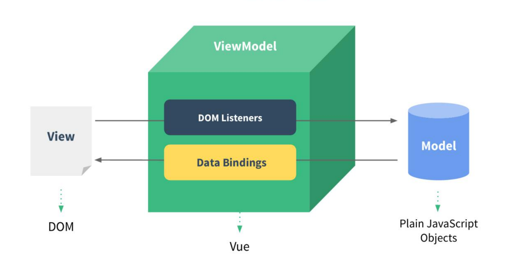
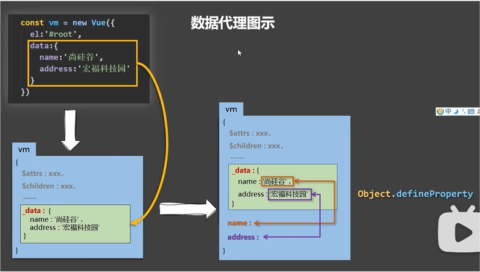
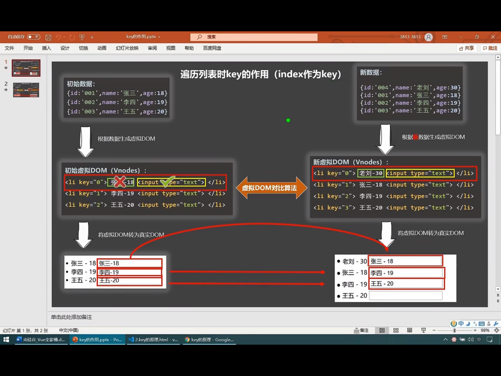
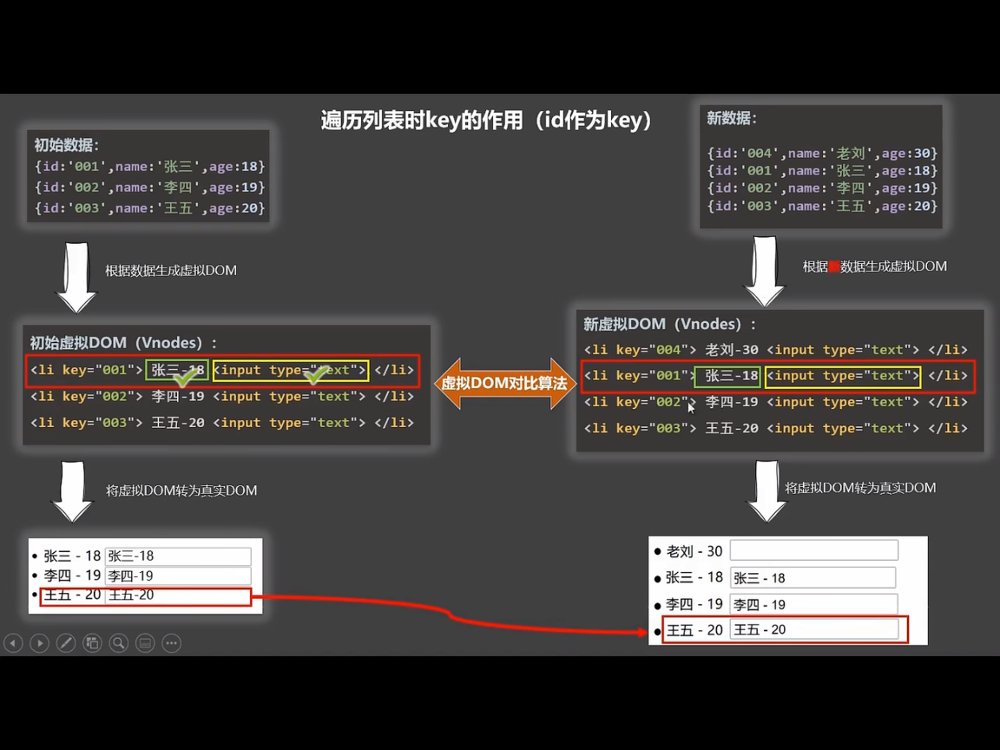
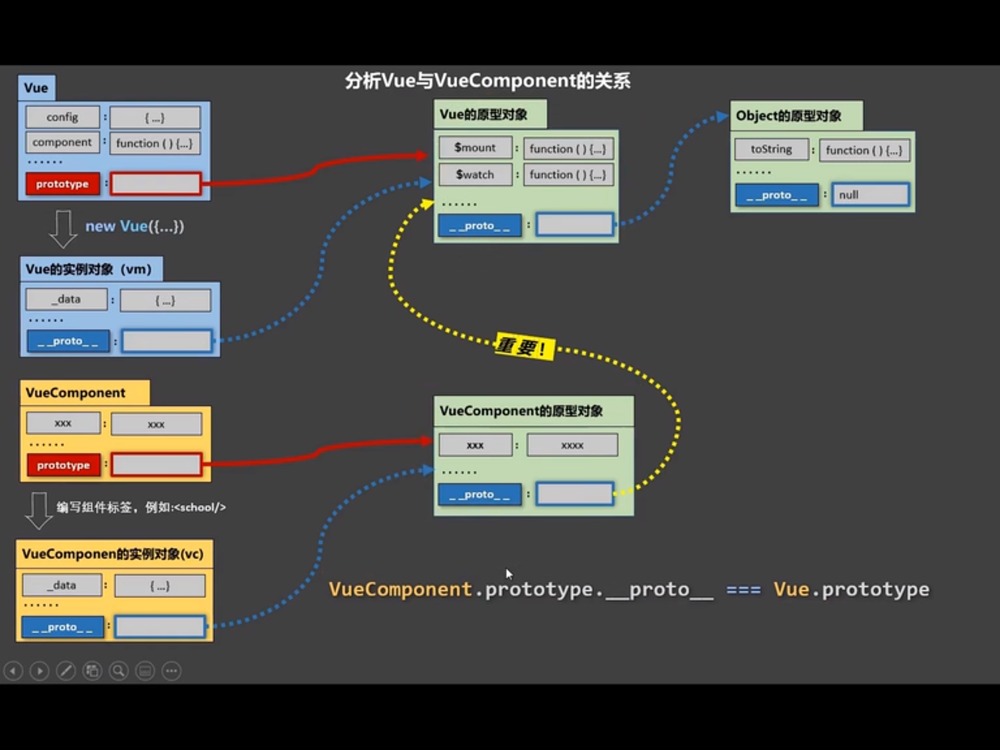

> 以下是观看尚硅谷Vue课程所做的笔记。
>
> [尚硅谷Vue](https://www.bilibili.com/video/BV1Zy4y1K7SH/?spm_id_from=333.337.search-card.all.click)

# vue简介

**vue是什么？**

Vue是一套用于构建用户界面的渐进式框架。

**为什么学？**

1.原生JS操作DOM繁琐，效率低

2.使用JS直接操作DOM,浏览器会进行大量的重绘重排

3.原生JS没有组件化编码方案，代码复用低

> 在学习之前最好看一下关于npm的知识：下面是我在网上看见的一个写的还不错的npm的文章
>
> [npm](https://blog.csdn.net/qq_25502269/article/details/79346545)

# Vue入门

## Vue 基础案例

1.先倒入两个包：

```
[vue.js or vue.min.js]

开发版本：vue.js        //包含完整的警告和调试模式
生产版本：vue.min.js    //删除了警告，37.51KB min+gzip

```

2.创建一个容器

3.创建Vue实例，渲染到容器中

``` html
    <!-- 准备好一个容器 -->
    <div id="root">
        <h1>{{txt}}</h1>
    </div>

    <script type="text/javascript">
        Vue.config.productionTip = false // 阻止vue在启动时生成的生产提示

        // 创建vue实例
        new Vue ({
            el:'#root', //el用于指定当前vue实例为哪个容器服务，值通常为css选择器字符串。
            data:{     //data用于存储数据，数据供el所指定的容器去使用，值暂时为一个对象。
                txt:'hello'
            },
        })
    </script>
```

这样，就会在页面中的这个div容器上渲染数据内容.

## vue初识

1.想让vue工作，就必须创建一个vue实例，且要传入一个配置对象。

2.root容器里的代码依然符合html规范，只不过混入一些特殊的vue语法。

3.root容器里的代码被称为【vue模板】。

4.vue实例和容器时一一对应的。

5.真实开发中只有一个vue实例，并且会配合组件一起使用。

6.{{xxx}}中的xxx要写js表达式，且xxx可以自动读取到data中所有的属性。

7.一旦data中的数据发生改变，那么页面中用到该数据的地方都会自动更新。

> 关于JS表达式和JS代码（语句）：
>
>   JS表达式：一个表达式会生成一个值，可以放在任何一个需要值的地方；
>           
>   (1). a (2). a+b (3). demo(1) (4). x===y ? 'a' : 'b'
>
>   JS语句：if(){} for(){} while(){} swith(){} 不会返回一个值

## vue模板语法有两大类

**1.插值语法**

```html
    <div id="root">
        <h1>插值语法</h1>
        <h3>hello,{{name}}</h3>
    </div>
```

功能：用于解析标签体的内容。

写法：`{{xxx}}`，xxx是js表达式，且可以直接读取到data中的所有属性。

**2.指令语法**

```js
    <div id="root">
        <h1>指令语法</h1>
        <a v-bind:href="url">点我去尚硅谷学习</a>
        {/* 简写 */}
        <a :href="url">点我去尚硅谷学习</a>
    </div>
```

功能：用于解析标签（包括：标签属性、标签体内容、绑定事件....）

举例：`v-bind:href="xxx"` 或简写成 `:href="xxx"`. xxx同样要写js表达式。且可以直接读取到data中的所有属性。 

备注：Vue中有很多指令，且形式都是：`v-???`，此处我们只是拿`v-bind`举个例子。

# vue中有两种数据绑定的方式

**1.单向绑定(v-bind)**

```html
    <div id="root">
        单向数据绑定：<input type="text" :value="name">
    </div>
```

数据只能从data流向页面

**2.双向绑定(v-model)**

```html
    <div id="root">
        双向数据绑定：<input type="text" v-model:value="name">
        <!-- 简写 -->
        双向数据绑定：<input type="text" v-model="name">
    </div>
```

1. 双向绑定一般都应用在表单类元素上（如：`input`、`select`等）

2. `v-model:value` 可以简写为`v-model`，因为`v-model`默认就是收集value值的

# vue中data与el的两种写法

**el的两种写法**

```html
    const vm = new Vue({
        // el:'#root', // 第一种写法
    })

    vm.$mount('#root') // 第二种写法 
```

(1) new Vue时配置el属性。

(2) 先创建vue实例，随后通过vm.$mount('#root')指定el的值。

**data的两种写法**

```html
    new Vue({
        el:'#root',
        // data第一种写法：对象式
        /* data:{
            name:'尚硅谷'
        } */

        // data第二种写法：函数式
        /* data(){ 
            console.log('@@@',this) //此处的this式Vue的实例对象
            return{
                name:'尚硅谷'
            }
        } */
    })
```

(1) 对象式

(2) 函数式


> **如何选择：** 目前哪种写法都可以，以后学习到组件时，data必须使用函数式，否则会报错。 
>
> **一个重要原因：** 由vue管理的函数，一定不要写箭头函数，一旦写了箭头函数，this就不再是vue实例了。

# MVVM模型

1. M：模型(Model)：对应data中的数据

2. V：视图(View)：模板

3. VM：视图模型(View Model)：Vue实例对象



> **观察发现**  
>
> 1.data中所有的属性，最后都出现在了vm身上
>
> 2.vm身上所有的属性 及 vue原型上的所有属性，在vue模板中都可以直接使用

# 数据代理

## 何为数据代理
通过一个对象代理对另一个对象中的属性进行操作（读/写） 

```html
    let obj1 = {x:1}
    let obj2 = {y:1}

    Object.defineProperty(obj2,'x',{
        get(){
            return obj1.x
        },
        set(val){
            obj1.x = val
        }
    });
```

## vue中的数据代理

1.vue中的数据代理：通过vm对象来代理data对象中属性的操作(读/写)

2.vue中数据代理的好处：更加方便的操作data中的数据

3.基本原理：

(1) 通过Object.defineProperty()把data对象中所有属性添加到vm上。

(2) 为每一个添加到vm上的属性，都指定一个setter或者getter。

(3) 在getter/setter内部去操作(读/写)data中对应的属性。



# 事件处理

## 事件处理的基本使用

1.使用v-on:xxx 或 @xxx 绑定事件，其中xxx是事件名;

2.事件的回调需要配置在methods对象中，最终会在vm上;

3.methods中的配置函数，不要用箭头函数！否则this就不是vm了;

4.methods中的配置函数，都是被Vue所管理的函数，this的指向是vm 或 组件实例对象;

5.@click="demo" 和 @click="demo($event)" 效果一致，后者可以传参;

## 事件修饰符

1.prevent：阻止默认事件(常用)

```html
<a href="http://www.atguigu.com/" @click.prevent="showInfo">点我提示信息</a>
```

2.stop：阻止事件冒泡(常用)

```html
    <div class="demo1" @click="showInfo">
        <button @click.stop="showInfo">点我提示信息</button>
        <!-- 修饰符可以连续写 -->
        <a href="http://www.atguigu.com/" @click.prevent.stop="showInfo">点我提示信息</a>
    </div>
```

3.once：事件只触发一次(常用)

```html
    <button @click.once="showInfo">点我提示信息</button>
```

4.capture：使用事件的捕获模式(事件发生顺序：先捕获后冒泡)

```html
    <div class="box1" @click.capture="showMsg(1)">
        div1
        <div class="box2" @click="showMsg(2)">
            div2
        </div>
    </div>
```

5.self：只有event.target是当前操作的元素时才触发事件

```html
    <div class="demo1" @click.self="showInfo">
        <button @click="showInfo">点我提示信息</button>
    </div>
```

6.passive：事件的默认行为立即执行，无需等待事件回调执行完成

```html
    <ul @wheel.passive="demo" class="list">
        <li>1</li>
        <li>2</li>
        <li>3</li>
        <li>4</li>
        <li>5</li>
    </ul>
```

## 键盘事件

```html
    <input @keyup.enter="showInfo" placeholder="点我提示信息">
    <!-- 键盘事件可以连续写 -->
    <input @keyup.ctrl.y="showInfo" placeholder="点我提示信息">
```

1.vue中常用的按键名称：

(1) 回车 ==> enter

(2) 删除 ==> delete (捕获"删除"和"退格"键)

(3) 退出 ==> esc 

(4) 空格 ==> space

(5) 换行 ==> tab (必须配合keydown使用 )

(6) 上 ==> up

(7) 下 ==> down

(8) 左 ==> left

(9) 右 ==> right

2.vue未提供别名的按键，可以使用按键原始的key值去绑定，但要注意转为kebab-case(短横线命名)

3.系统修饰符(用法特殊)：ctrl、alt、shift、meta
    
(1)配合keyup使用：按下修饰键的同时，再按下其他键，随后释放其他键，事件才被触发。

(2)配合keydown使用：正常触发事件。

4.也可以使用keyCode去指定具体的按键(不推荐)

5.Vue.config.keyCode.自定义键名 = 键码，可以去定制按键别名

# 计算属性

1.定义：要用的属性不存在，要通过已有的属性计算得来。

2.原理：底层借助了`Object.defineProperty`方法提供的`getter`和`setter`。

3.get函数什么时候执行？

(1)初次读取时会执行一次。

(2)当依赖数据发生变化时会被再次调用。

4.优势：与methods实现相比，内部有缓存机制(复用)，效率更高，调试更加方便。

> **备注：**
>
>(1). 计算属性最终会出现在vm上，直接读取使用即可。
>
>(2). 如果计算属性要被修改，那必须写set函数去响应修改，且set中要引起计算时依赖的数据发生改变。

```html
    // 完整写法
    fullName:{
        get(){
            console.log('get被调用了')
            return this.lastName + '-' + this. firstName
        },
        set(value){
            console.log('set',value)
            const str = this.fullName.split('-');

            this.lastName = str[0]
            this.firstName = str[1]
        }
    }
```

```html
    // 简写(只考虑读取，不考虑修改)
    fullName(){
        console.log(this)
        return this.lastName + '-' + this. firstName
    }
```

# 监视属性

## 监视属性

1.当被监视的属性变化时，回调函数自动调用，进行相关操作

2.监视的属性必须存在，才能进行监视！！

3.监视的两种方法：

(1).new Vue时传入watch配置

```html
    watch:{
        isHot:{
            immediate:true,         // 初始化时让handler调用一下
            // handler什么时候调用？当isHot发生改变的时候
            handler(newVal,oldVal){
                console.log('isHot',newVal,oldVal)
            }
        }
    }, 
```

(2). 通过vm.$watch监视

```html
    vm.$watch(('isHot'),{
        immediate:true,         // 初始化时让handler调用一下
        // handler什么时候调用？当isHot发生改变的时候
        handler(newVal,oldVal){
            console.log('isHot',newVal,oldVal)
        }
    })
```

4.简写

```html
    //简写(使用场景：只用到handler属性时)
    isHot(newVal,oldVal){
        console.log('isHot',newVal,oldVal)
    }

    vm.$watch(('isHot'),function(newVal,oldVal){
        console.log('isHot',newVal,oldVal)
    })
```

## 深度监视

1.Vue中的watch默认不监测对象内部值的改变(一层)

2.配置deep:true可以监测对象内部值改变(多层)

> **备注**
>
>(1). vue本身可以监测对象内部值的改变,但vue提供的watch默认不可以!!
>
>(2). 使用watch时根据数据的具体结构,决定是否采用深度监视.

```html

    // 监视多级结构中某个属性的变化
    'numbers.a':{
        handler(newVal,oldVal){
            console.log('打印数据numbers.a',newVal,oldVal)
        }
    }, 

    // 监视多级结构中所有属性的变化
    numbers:{
        deep:true, //深度监视
        handler(newVal,oldVal){
            console.log('打印数据numbers',newVal.a,oldVal)
        }   
    },
```

# !!watch对比computed
>
>1.computed能完成的功能，watch都可以完成。
> 
>2.watch能完成的功能，computed不一定能完成，例如：watch可以进行异步操作。
>
>**两个重要的小原则：**
>
>1.所被vue管理的函数，最好写成普通函数，这样this的指向才是 vm 或者 实例对象
>
>2.所有不被Vue所管理的函数（定时器回调函数、ajax的回调函数等、promise的回调函数），最好写成箭头函数，这样this的指向才是 vm 或者 实例对象。
>

# 绑定样式

## class样式

写法：class = "xxx" xxx可以是字符串、对象、数组

1.  字符串写法适用于：类名不确定，要动态获取

2.  数组写法适用于：要绑定的样式个数不确定、名字也不确定

3.  对象写法，适用于：要绑定的样式个数确定、名字也确定，但要动态决定用不用

## style样式

1.  :style = "{fontSize:xxx}",xxx为动态值

2.  :style = "[a,b]" 其中a,b是样式对象

# 条件渲染

## v-if

写法：

1.  v-if = "表达式"

2.  v-else-if = "表达式"

3.  v-else = "无需表达式"

适用于：切换频率较低的场景

特点：不展示的DOM元素直接被移除

**注意：** v-if可以和v-else-if、v-else一起使用，但要求结构不能被打断

## v-show

写法；v-show = "表达式"

适用于：切换频率较高的场景

特点：不展示的DOM元素未被移除，仅仅是使用样式隐藏掉

>**备注：**
>
>使用v-if时，元素可能无法获取到，而使用v-show一定能够获取到。

# 列表渲染

## v-for指令

1.  用于展示列表的数据

2.  语法：v-for="(item,index) in xxx" :key="yyy"

3.  可遍历：数组，对象，字符串（用的少），指定次数（用的少）

## key的原理

**经典面试题目：**

1). react/Vue的key有什么作用呢？(key的内部原理是什么？)

2). 为什么遍历列表时，key最好不要用index？

    1.在虚拟DOM中key的作用：
        1). 简单点说，key是虚拟DOM对象的标识，在更新显示时key起着极其重要的作用。
        2). 详细的说：当状态中的数据发生变化的时候，react会根据【新数据】生成【新的虚拟DOM】，
        随后React进行【新虚拟DOM】与【旧虚拟DOM 】的diff比较，比较规则如下：
                
            a. 旧虚拟DOM中找到了与新虚拟DOM相同的key：
                (1).若虚拟DOM中内容没变，直接使用之前的真实DOM
                (2).若虚拟DOM中内容变了，则生成新的真实DOM，随后替换掉页面的真实DOM

            b. 旧虚拟DOM中未找到与新虚拟DOM相同的key
                根据数据创建新的真实的DOM，随后渲染到页面

    2.用index作为key可能会引发的问题：
        1.  若对数据进行：逆序添加、逆序删除等破坏顺序的操作：
            会产生没有必要的真实DOM更新 ===> 界面效果没问题，但是效率低

        2.  如果结构中还包含输入类DOM：
            会产生错误DOM更新 ==> 界面有问题
        
        3.  注意！如果不存在对数据进行逆向添加，逆序删除等破坏顺序的操作，
            仅用于渲染列表用于展示，使用index作为key是没有问题的。
    
    3.开发中如何选择key？
        1.最好使用每条数据的唯一标识作为key，比如id、手机号、身份证号、学号等唯一值
        2.如果确定只是简单的展示数据，用index也是可以的。




## 列表过滤

**watch实现**

```html
    watch:{
        keyWord:{
            immediate:true,
            handler(val){
                this.filPersons = this.persons.filter((p)=>{
                    return p.name.indexOf(val) != -1
                })  
            }
        }
    }
```

**computed实现**

```html
    computed:{
        filPersons(){
            return this.persons.filter((p)=>{
                return p.name.indexOf(this.keyWord) != -1
            })
        }
    }
```

## 列表排序

```html
    arr.sort((item1,item2)=>{
        return this.sortType == 1?  item1.age - item2.age : item2.age - item1.age
    })
```

# 监视数据原理

## vue监视数据原理

1.vue会监视data中所有层次的数据

2.如何监测对象中的数据?

    通过setter中实现监视，且要在new Vue时就传入要监测的数据。

        (1).对象中后追加的属性，Vue默认不做响应式处理。
        (2).如需给后添加的属性做响应式，请使用如下API：
            Vue.set(target. propertyName/index. value)
            this.$set(target. propertyName/index. value)

3.如何监测数组中的数据

    通过包裹数组更新元素的方法实现，本质就是做了两件事：

        (1).调用原生对应的方法对数组进行更新。
        (2).重新解析模板，进而更新页面。

4.在Vue修改数组中的某个元素一定要用如下方法：

    1.使用这些API:push()、pop()、shift()、unshift()、splice()、sort()、reverse()
    2.Vue.set() 或 vm.$set

**特别注意**：Vue.set() 和 vm.$set 不能给 vm 或者 vm的根数据对象 添加属性！！！！ 

# 收集表单数据

若：```<input  type="text" />```，则v-model收集的是value值，用户输入的就是value的值。

若：```<input type="radio" /> ```，则v-model收集的是value值，且要给标签配置value值。

若：```<input type="checkbox" /> ```

    1.没有配置input的value属性，那么收集的就是checked (勾选 or 未勾选 ，是布尔值)
    2.配置input的value属性：
        (1).v-model的初始值是非数组，那么收集的就是checked (勾选 or 未勾选 ，是布尔值)
        (1).v-model的初始值是数组，那么收集的就是value组成的数组

>**备注：v-model的三个修饰符：**
>
>   lazy：失去焦点再收集数据
>
>   number: 输入字符串转为有效数字
>
>   trim: 输入首尾空格过滤

# 过滤器

定义：对要显示的数据，进行特定格式化后再显示（适用于一些简单的逻辑处理）

语法：

    1.注册过滤器：Vue.filter(name,callback) 或 new Vue(filter:{}}
    2.使用过滤器：{{xxx | 过滤器名}} 或 v-bind:属性 = "xxx | 过滤器名"

备注：

    1.过滤器也可以接收额外的参数、多个过滤器也可以串联
    2.并没有改变原来的数据，是产生新的对应的数据

# 内置指令

## 回忆

1.  v-bind ：单向绑定解析表达式，可简写为 :xxx

2.  v-model : 双向数据绑定

3.  v-for ：遍历数组/对象/字符串

4.  v-on ：绑定事件监听，可简写为@

5.  v-if ： 条件渲染（动态控制节点是否存在）

6.  v-else ：条件渲染（动态控制节点是否存在）

7.  v-show ：条件渲染（动态控制节点是否存在）

## 其他内置指令

1.v-text指令：

    1.作用：向其所在的节点中渲染文本内容
    2.与插值语法的区别：v-text会替换掉节点的内容，{{xxx}}则不会

2.v-html指令：

    1.作用：向指定节点中渲染包含html结构的内容
    2.与插值语法的区别：
        (1).v-html会替换掉节点中所有的内容，{{xxx}}则不会
        (2).v-html可以识别html结构
    3.严重注意：v-html有安全性问题
        (1).在网站上动态渲染任意HTML是非常危险的，容易导致XSS攻击
        (2).一定要在可信的内容上使用v-html，不要使用在用户提交的内容上！！！

3.v-cloak指令：

    1.本质是一个特殊属性，Vue实例创建完毕并接管容器后，会删掉v-cloak属性。
    2.使用css配合v-cloak可以解决网速加载慢时页面展示出{{xxx}}的问题。

3.v-once指令：

    1.v-once所在节点在初次动态渲染后，就视为静态内容了。
    2.以后数据的改变不会引起v-once所在结构的更新，可以用于优化性能。

3.v-pre指令：

    1.跳过其所在节点的编译过程
    2.可利用它跳过，没有使用指令的语法、没有使用插值语法的节点，会加快编译

# 自定义指令

1.定义语法

    (1).局部指令：
        new Vue({
            directives:{指令名:配置对象} 
        })

        或

        new Vue({
            directives{指令名:回调函数} 
        })

    (2).全局指令
        Vue.directive(指令名,配置对象)
        Vue.directive(指令名,回调函数)

2.配置对象中常用的3个问题

    (1).bind : 指令与元素成功绑定时调用。
    (2).inserted : 指令所在元素被插入页面时调用
    (3).update : 指令所在模板结构被重新解析时调用

3.备注

    1.指令定义时不加v-，但使用时要加v-；
    2.指令名如果是多个单词，要使用kebab-case命名方式，不要使用camelCase命名。

# 生命周期

1.又名：生命周期回调函数、生命周期函数、生命周期钩子

2.是什么：Vue在关键时候帮我们调用的一些特殊名称的函数

3.生命周期函数的名字不可更改，但函数的具体内容是程序员根据需求编写的。

4.生命周期函数中的this指向是 vm 或 组件实例对象 


## 常用生命周期钩子

1.mounted : 发送ajax请求、启动定时器、绑定自定义事件、订阅消息等【初始化操作】

2.beforeDestroy ：清除定时器、解绑自定义事件、取消订阅消息等【收尾工作】

## 关于销毁Vue实例

1.销毁后借助Vue开发者工具看不到任何消息

2.销毁后自定义事件会失效，但原生DOM事件依旧有效

3.一般不会在beforeDestroy操作数据，因为即使操作数据，也不会再触发更新流程了。

# 组件

理解：用来实现局部（特定）功能效果的代码集合（html/css/js/image...）

>**使用组件三大步骤**
>
>1.定义组件（创建组件）
>
>2.注册组件
>
>3.使用组件（写组件标签）

## 如何定义一个组件

使用 ```Vue.extend(options)``` 创建，其中options 和 ```new Vue(options)``` 时传入的 options 几乎一样，但区别如下：

    1.el不要写，为什么？———— 最终所有的组件都要经过一个vm的管理，由vm中的el决定服务哪个容器
    2.data必须写成函数，为什么？———— 避免组件被复用时，数据存在引用关系。

    备注：使用template可以配置组件结构。

## 如何注册组件

1.局部注册：靠 new Vue 的时候传入components选项

2.全局注册：靠 Vue.component('组件名',组件)

## 编写组件标签

```html
<school></school>
```

## 关于组件名

1.一个单词组成 :

    第一种写法 (首字母小写)：school
    第二种写法 (首字母大写)：school

2.多个单词组成：

    第一种写法 (kebab-case命名)：my-school
    第二种写法 (CamelCase命名)：MySchool（需要Vue脚手架支持）

>**备注：**
>
>(1).组件名尽可能回顾HTML中已有的元素名称：例如：h2、H2都不行。
>
>(2).可以使用name配置项指定组件在开发者工具中呈现的名字。

## 关于组件标签

第一种写法：```<school></school>```

第二种写法：```<school/>```

备注：不用使用脚手架时，```<school/>```会导致后续组件不能渲染

## 简写方式

```
const school = Vue.extend(options) 
可简写为：const school = options
```

## 关于VueComponent:

1.school组件本质是一个名为VueComponent的构造函数，且不是程序员定义的，是Vue.extend生成的

2.我们只需要写 ```<school></school>``` 或 ```<school/>``` ，vue解析时会帮我们创建school组件的实例对象，即Vue帮我们执行的：new VueComponent(options)。

3.特别注意：每次调用Vue.extend，返回的都是一个个全新的VueComponent！！！

4.关于this指向：

    (1).组件配置中：
        data函数、methods中的函数、watch中的函数、computed中的函数 它们的this均是VueComponent
    (2).new Vue(options)配置中：
        data函数、methods中的函数、watch中的函数、computed中的函数 它们的this均是【Vue实例】

5.VueComponent的实例对象，以后简称vc（也可称之为：组件实例对象）

Vue的实例对象，以后简称vm。

## 一个重要的内置关系

1.一个重要的内置关系：```VueComponent.prototype.__proto__ === Vue.prototype```

2.为什么要有这个关系：让组件实例对象（vc）可以访问到 Vue原型上的属性和方法  

